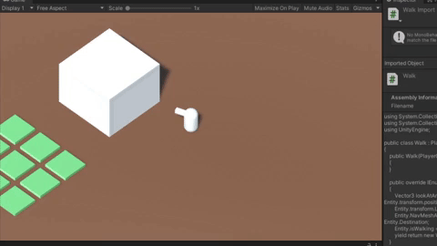

# spring

Currently in development: 
  - Player Inventory

<h2>Camera and Player Movement</h2>

Isometric camera view and player movement

 

<h2>Interactable Garden Tiles</h2>

Behaviour when interacting with a garden tile, on mouse hover highlights the tile, on click interacts with the tile

 

<h2>First Implementation of Inventory System</h2>

First inventory system, inventory opens with Tab key, currently has multiple stacks of dummy items, the numbers represent the amount of that item and each slot is a unique item. It is also possible to walk around with the inventory open

